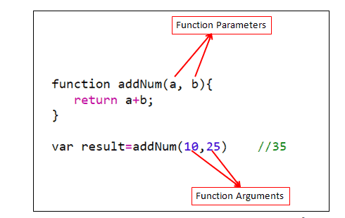

# 📚 Functions in JavaScript: Basics, Nested, and Reusable

## 🧾 Problem Statement
Create a program to manage a **To-Do List**. Users should be able to **add tasks**, **mark tasks as completed**, **delete tasks**, and **display tasks**.

---

## ✅ 1. Basic Function
A basic function performs a specific task and can be called when needed.

```javascript
// Function to add a task to the list
function addTask(taskList, task) {
    taskList.push({ task, completed: false });
    console.log(`Task added: ${task}`);
}
```

### 📌 Usage:
```javascript
let tasks = [];
addTask(tasks, "Complete Angular project");
console.log(tasks);
```

---

## ✅ 2. Nested Function
A function defined inside another function. It helps when a subtask is specific to the parent task.

```javascript
// Function to manage tasks with a nested display function
function taskManager() {
    let tasks = [];

    function addTask(task) {
        tasks.push({ task, completed: false });
        console.log(`Task added: ${task}`);
    }

    function displayTasks() {
        tasks.forEach((t, index) => console.log(`${index + 1}. ${t.task} - ${t.completed ? 'Done' : 'Pending'}`));
    }

    return { addTask, displayTasks };
}

const myTasks = taskManager();
myTasks.addTask("Learn React");
myTasks.displayTasks();
```

### 📌 Why Nested?
Keeps related functions grouped and avoids polluting the global scope.

---

## ✅ 3. Reusable Function
A function that works for **any input** and can be used in **different scenarios**.

```javascript
// Function to mark a task as completed
function markTaskCompleted(taskList, index) {
    if (taskList[index]) {
        taskList[index].completed = true;
        console.log(`Task marked as completed: ${taskList[index].task}`);
    } else {
        console.log("Invalid task index.");
    }
}
```

### 📌 Usage:
```javascript
let myTasks = [{ task: "Learn JavaScript", completed: false }];
markTaskCompleted(myTasks, 0);
console.log(myTasks);
```

---

## 📚 More Examples

### 4. **Function with Default Parameters**
```javascript
function deleteTask(taskList, index = taskList.length - 1) {
    if (taskList[index]) {
        console.log(`Task deleted: ${taskList[index].task}`);
        taskList.splice(index, 1);
    } else {
        console.log("Task not found.");
    }
}
```

### 5. **Function Expression**
```javascript
const countTasks = function (taskList) {
    return taskList.length;
};
```

### 6. **Arrow Function**
```javascript
const clearTasks = (taskList) => taskList.length = 0;
```

### 7. **Higher-Order Function (using map)**
```javascript
function getPendingTasks(taskList) {
    return taskList.filter(task => !task.completed).map(task => task.task);
}
```

### 8. **Recursive Function**
```javascript
function printTasksRecursively(taskList, index = 0) {
    if (index < taskList.length) {
        console.log(`${index + 1}: ${taskList[index].task}`);
        printTasksRecursively(taskList, index + 1);
    }
}
```

### 9. **IIFE (Immediately Invoked Function Expression)**
```javascript
(function () {
    console.log("To-Do List Initialized");
})();
```

### 10. **Callback Function**
```javascript
function processTasks(taskList, callback) {
    taskList.forEach(callback);
}

processTasks(myTasks, (task) => console.log(task.task));
```

---


