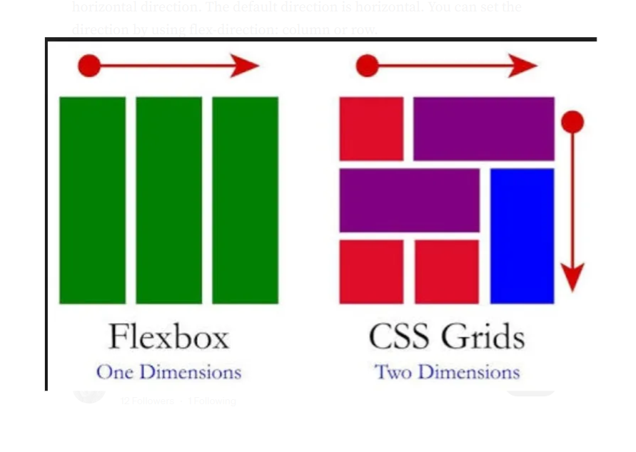

## **Flexbox and Grid Concepts**  

### **🔹 Flexbox (Flexible Box Layout)**  
**Definition:** Flexbox is a one-dimensional layout model that arranges items either in a row or a column. It is useful for aligning items and distributing space efficiently.  

### **📌 Flexbox Properties**  
#### **1. Parent (Flex Container) Properties:**  
- `display: flex;` → Enables flexbox on a container.  
- `flex-direction: row | column;` → Defines main axis (horizontal or vertical).  
- `justify-content: flex-start | center | space-between | space-around;` → Aligns items along the main axis.  
- `align-items: flex-start | center | stretch;` → Aligns items along the cross axis.  
- `flex-wrap: wrap | nowrap;` → Allows items to wrap if they exceed the container width.  

#### **2. Child (Flex Items) Properties:**  
- `flex-grow: 1;` → Makes an item grow to fill available space.  
- `flex-shrink: 1;` → Controls how an item shrinks when there is not enough space.  
- `align-self: center | flex-end;` → Aligns an individual item differently from others.  

#### **✅ Example: Simple Flexbox Layout**  
```html
<!DOCTYPE html>
<html lang="en">
<head>
    <style>
        .container {
            display: flex;
            justify-content: space-around;
            align-items: center;
            background: lightgray;
            height: 200px;
        }
        .box {
            width: 100px;
            height: 100px;
            background: tomato;
            text-align: center;
            line-height: 100px;
            font-weight: bold;
        }
    </style>
</head>
<body>
    <div class="container">
        <div class="box">Box 1</div>
        <div class="box">Box 2</div>
        <div class="box">Box 3</div>
    </div>
</body>
</html>
```
**Output:** Three boxes aligned in a row with space around them.  

---

### **🔹 CSS Grid (Grid Layout)**  
**Definition:** CSS Grid is a two-dimensional layout system that allows for precise placement of elements in both rows and columns.  

### **📌 Grid Properties**  
#### **1. Grid Container Properties:**  
- `display: grid;` → Enables grid layout on a container.  
- `grid-template-columns: 1fr 1fr 1fr;` → Defines three equal columns.  
- `grid-template-rows: auto;` → Defines rows with automatic height.  
- `gap: 10px;` → Adds spacing between grid items.  
- `justify-items: center;` → Aligns items horizontally inside the grid.  

#### **2. Grid Item Properties:**  
- `grid-column: span 2;` → Makes an item span two columns.  
- `grid-row: span 2;` → Makes an item span two rows.  

#### **✅ Example: Simple Grid Layout**  
```html
<!DOCTYPE html>
<html lang="en">
<head>
    <style>
        .grid-container {
            display: grid;
            grid-template-columns: repeat(3, 1fr);
            gap: 10px;
            background: lightblue;
            padding: 10px;
        }
        .grid-item {
            background: darkblue;
            color: white;
            text-align: center;
            padding: 20px;
            font-size: 20px;
        }
        .grid-item:nth-child(1) {
            grid-column: span 2;
        }
    </style>
</head>
<body>
    <div class="grid-container">
        <div class="grid-item">1 (Span 2 columns)</div>
        <div class="grid-item">2</div>
        <div class="grid-item">3</div>
        <div class="grid-item">4</div>
        <div class="grid-item">5</div>
    </div>
</body>
</html>
```
**Output:** A grid where the first item spans two columns.  

---

### **🔹 Flexbox vs Grid Summary**  
| Feature  | Flexbox | Grid |
|----------|--------|------|
| Layout Direction | 1D (row or column) | 2D (rows & columns) |
| Use Case | Simple UI elements (navbars, buttons) | Complex layouts (dashboards, websites) |
| Alignment | `justify-content`, `align-items` | `grid-template`, `gap` |
| Child Placement | Limited control | Precise placement |

This covers the **concepts with examples** for easy understanding. 🚀 Let me know if you need modifications! 😊